**Lab project: Building a Highly Available, Scalable Web Application**

> 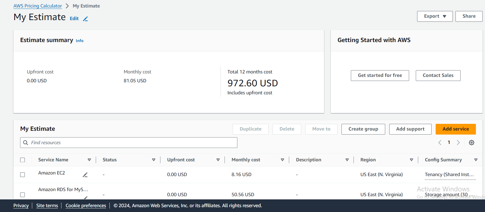

***Tạo ứng dụng web chứa các chức năng cơ bản***

**[Tạo VPC ( Virtual Private Cloud)]{.underline}**

-   Trong cửa sổ trình duyệt của AWS, ấn vào Services, chọn All
    Services, chọn VPC.

-   Chọn **Create VPC**

-   Cài đặt cấu hình cho VPC như sau:

```{=html}
<!-- -->
```
-   Resources to create: **Choose VPC only.**

-   Name tag: project-vpc-vpc.

-   IPv4 CIDR: **10.0.0.0/16**

```{=html}
<!-- -->
```
-   Cuối cùng chọn nút **Create VPC**

-   Trong Your VPCs:

```{=html}
<!-- -->
```
-   Chọn **VPC vừa tạo.**

-   Ấn vào Action: chọn **Edit VPC Settings.**

-   Tích các mục như sau:

> 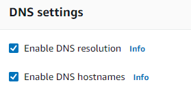

-   Đối với việc tạo VPC thì sẽ bao gồm các thành phần sau:

```{=html}
<!-- -->
```
-   Tạo subnet

-   Tạo Internet gateway

-   Tạo Route Tables

```{=html}
<!-- -->
```
-   Chúng ta cần tạo ra 4 subnet, 2 subnet Public và 2 subnet Private,
    công việc **tạo subnet** gồm những bước sau đây:

```{=html}
<!-- -->
```
-   Ở navigation left -\> chọn **Subnets**

-   Chọn **Create subnet.**

-   Ở mục VPC ID: chọn VPC của mình vừa tạo.

-   Mục Subnet name: project-VPC-subnet-public1-us-east-1a (tên subnet
    public 1).

-   Chọn vùng Availability Zone: **US East (N.Virginia) / us-east-1a**

-   IPv4 VPC CIDR block: 10.0.0.0/16

-   IPv4 subnet CIDR block: ***10.0.1.0/24***

-   Sau đó ấn nút Create subnet

-   Tiếp đến chúng ta tiếp tục tạo thêm 1 subnet public, 2 subnet
    private

```{=html}
<!-- -->
```
-   project-VPC-subnet-public2-us-east-1b, vùng **US East (N.Virginia) /
    us-east-1b** và IPv4 subnet CIDR block: ***10.0.2.0/24***

-   project-VPC-subnet-private1-us-east-1a, vùng **US East (N.Virginia)
    / us-east-1a** và IPv4 subnet CIDR block: ***10.0.3.0/24***

-   project-VPC-subnet-private2-us-east-1b, vùng **US East (N.Virginia)
    / us-east-1b** và IPv4 subnet CIDR block: ***10.0.4.0/24***

```{=html}
<!-- -->
```
-   Sau khi đã tạo đủ 4 subnets, ở Subnets, trong danh sách các subnets,
    tìm public 1 và public 2 vừa tạo, lần lượt chọn từng subnet public.
    Ấn **Action** -\> chọn Edit subnet settings, sau đó tích như hình
    bên dưới để bật **auto-assign public IPv4:**

> 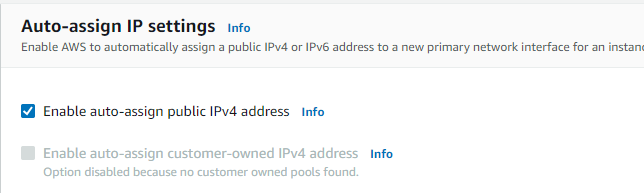

-   Chúng ta tiếp tục tạo **Internet Gateway**

```{=html}
<!-- -->
```
-   Ở navigation left, chọn **Internet gateways.**

-   Chọn nút **Create Internet gateways.**

-   Trong Internet gateway settings, tag name: project-VPC-igw

-   Chọn **Create internet gateway**

-   Tiếp theo chúng ta sẽ thực hiện gắn cổng internet vào VPC của mình:

-   Trong **internet gateway** -\> chọn **Action** -\> chọn **Attack to
    VPC.**

-   Tiếp theo, chúng ta sẽ **tạo 2 Route Tables**: 1 public và 1
    private.

-   Ở navigation left, chọn **Route tables**

-   Chọn **Create route table**

-   Name: project-VPC-rtb-public (Private: project-vpc-rtb-private)

-   Select VPC: chọn VPC mà mình đã tạo

-   Ấn nút **create route table**

-   Sau khi tạo public route table và private route table thì ở danh
    sách route table

-   Đối với **project-VPC-rtb-public** chọn **Edit subnet associations**
    và chọn **2 public subnet** đã tạo ở trên

-   Đối với **project-vpc-rtb-private** chọn **Edit subnet
    associations** và chọn **2 private subnet** đã tạo ở trên

-   Cuối cùng ấn **Save.**

-   Bước tiếp theo, chúng ta sẽ **tạo một máy ảo ( tạo EC2)**

-   Đầu tiên vào Services-\> chọn All Services-\> chọn **EC2**

-   Tiếp theo nhấn **Launch instance** để có thể tạo 1 EC2.

-   Name and tag: My Temp Web

-   Chọn **Ubuntu**

> 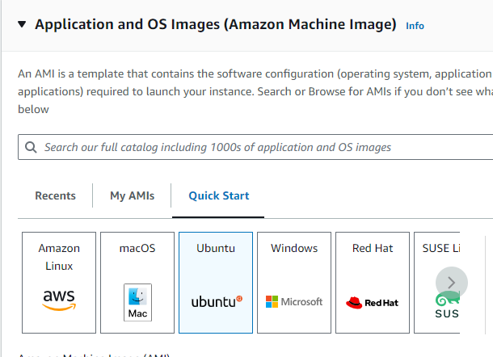

-   Key pair : chọn **Vokey**

-   Ở mục n**etwork settings**, chọn **Edit**, sau đó sẽ có một hộp
    thoại được mở ra như sau:

> 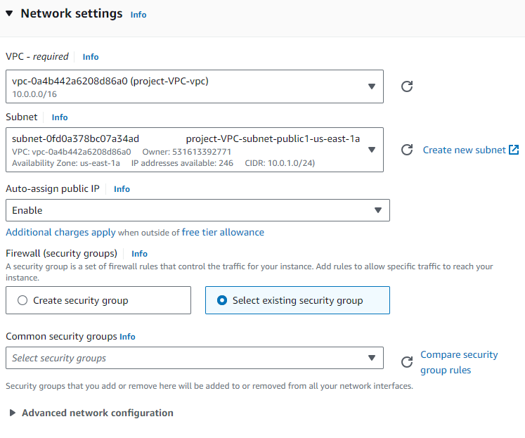

-   Chọn VPC mà mình đã tạo, chọn 1 **public subnet** ( ở đây chọn
    public 1)

-   **Auto-assign public IP** thì chỉnh thành **Enable.**

-   Chọn **Create security group**

-   Security group name:**EC2-SG**

-   Cài đặt **security group rules** như sau:

> 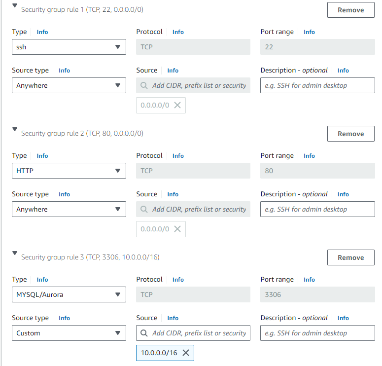

-   Ở phần **Advanced details**, chọn như hình dưới đây:

> 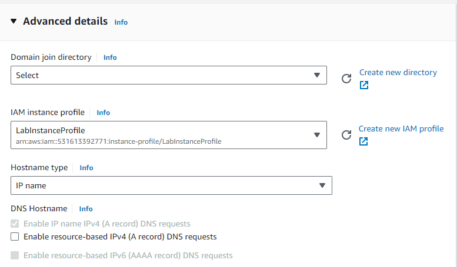

-   Và trong phần **user data**, chúng ta sẽ tải lên tệp
    UserdataScript-phase-2.sh với nội dung như sau:

+-----------------------------------------------------------------------+
| #!/bin/bash -xe                                                       |
|                                                                       |
| apt update -y                                                         |
|                                                                       |
| apt install nodejs unzip wget npm mysql-server -y                     |
|                                                                       |
| #wget                                                                 |
| https://aws-tc-lar                                                    |
| geobjects.s3.us-west-2.amazonaws.com/CUR-TF-200-ACCAP1-1-DEV/code.zip |
| -P /home/ubuntu                                                       |
|                                                                       |
| wget                                                                  |
| https://aws-tc-largeobjects.s3.us-west-2.amaz                         |
| onaws.com/CUR-TF-200-ACCAP1-1-79581/1-lab-capstone-project-1/code.zip |
| -P /home/ubuntu                                                       |
|                                                                       |
| cd /home/ubuntu                                                       |
|                                                                       |
| unzip code.zip -x \"resources/codebase_partner/node_modules/\*\"      |
|                                                                       |
| cd resources/codebase_partner                                         |
|                                                                       |
| npm install aws aws-sdk                                               |
|                                                                       |
| mysql -u root -e \"CREATE USER \'nodeapp\' IDENTIFIED WITH            |
| mysql_native_password BY \'student12\'\";                             |
|                                                                       |
| mysql -u root -e \"GRANT all privileges on \*.\* to                   |
| \'nodeapp\'@\'%\';\"                                                  |
|                                                                       |
| mysql -u root -e \"CREATE DATABASE STUDENTS;\"                        |
|                                                                       |
| mysql -u root -e \"USE STUDENTS; CREATE TABLE students(               |
|                                                                       |
| id INT NOT NULL AUTO_INCREMENT,                                       |
|                                                                       |
| name VARCHAR(255) NOT NULL,                                           |
|                                                                       |
| address VARCHAR(255) NOT NULL,                                        |
|                                                                       |
| city VARCHAR(255) NOT NULL,                                           |
|                                                                       |
| state VARCHAR(255) NOT NULL,                                          |
|                                                                       |
| email VARCHAR(255) NOT NULL,                                          |
|                                                                       |
| phone VARCHAR(100) NOT NULL,                                          |
|                                                                       |
| PRIMARY KEY ( id ));\"                                                |
|                                                                       |
| sed -i \'s/.\*bind-address.\*/bind-address = 0.0.0.0/\'               |
| /etc/mysql/mysql.conf.d/mysqld.cnf                                    |
|                                                                       |
| systemctl enable mysql                                                |
|                                                                       |
| service mysql restart                                                 |
|                                                                       |
| export APP_DB_HOST=\$(curl                                            |
| http://169.254.169.254/latest/meta-data/local-ipv4)                   |
|                                                                       |
| export APP_DB_USER=nodeapp                                            |
|                                                                       |
| export APP_DB_PASSWORD=student12                                      |
|                                                                       |
| export APP_DB_NAME=STUDENTS                                           |
|                                                                       |
| export APP_PORT=80                                                    |
|                                                                       |
| npm start &                                                           |
|                                                                       |
| echo \'#!/bin/bash -xe                                                |
|                                                                       |
| cd /home/ubuntu/resources/codebase_partner                            |
|                                                                       |
| export APP_PORT=80                                                    |
|                                                                       |
| npm start\' \> /etc/rc.local                                          |
|                                                                       |
| chmod +x /etc/rc.local                                                |
+-----------------------------------------------------------------------+

-   Ấn nút **launch instance** để tạo EC2

-   Bây giờ chúng ta đã có thể truy cập được trang web students và thực
    hiện các chức năng thêm, sửa xóa cơ bản ( chọn vào EC2 My Temp Web ,
    trong phần **Details**, lấy **Public IPv4 address** để truy cập vào
    trang web, ví dụ Public IPv4 address của tôi như sau:
    35.170.200.171, thì để truy cập được hãy gõ như sau:
    http://35.170.200.171

-   Trang web sẽ hiển thị như dưới đây

> 

***Tách riêng các thành phần của ứng dụng:***

*Ở phần này chúng ta sẽ thực hiện tách riêng máy ảo và cơ sở dữ liệu.*

-   Đầu tiên chúng ta sẽ **tạo thêm một máy ảo EC2** (không chứa phần cơ
    sở dữ liệu) có name: ***My web***

-   Hãy thực hiện lại các bước tạo một EC2 ở phần 2.

-   Nhưng ở đây chúng ta sẽ không chọn Create security group mà sẽ
    **chọn Select existing security group** và chọn **security group đã
    tạo ở phase 2**( khi tạo EC2 My Temp Web).

> 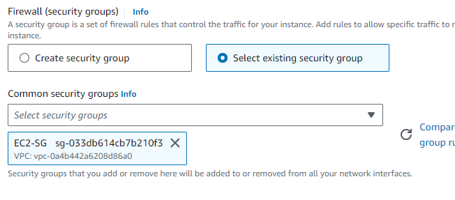
-   Và trong phần **user data** thì chúng ta sẽ sử dụng tệp
    UserdataScript-phase-3.sh có nội dung như sau:

+-----------------------------------------------------------------------+
| #!/bin/bash -xe                                                       |
|                                                                       |
| apt update -y                                                         |
|                                                                       |
| apt install nodejs unzip wget npm mysql-client -y                     |
|                                                                       |
| #wget                                                                 |
| https://aws-tc-lar                                                    |
| geobjects.s3.us-west-2.amazonaws.com/CUR-TF-200-ACCAP1-1-DEV/code.zip |
| -P /home/ubuntu                                                       |
|                                                                       |
| wget                                                                  |
| https://aws-tc-largeobjects.s3.us-west-2.amaz                         |
| onaws.com/CUR-TF-200-ACCAP1-1-79581/1-lab-capstone-project-1/code.zip |
| -P /home/ubuntu                                                       |
|                                                                       |
| cd /home/ubuntu                                                       |
|                                                                       |
| unzip code.zip -x \"resources/codebase_partner/node_modules/\*\"      |
|                                                                       |
| cd resources/codebase_partner                                         |
|                                                                       |
| npm install aws aws-sdk                                               |
|                                                                       |
| export APP_PORT=80                                                    |
|                                                                       |
| npm start &                                                           |
|                                                                       |
| echo \'#!/bin/bash -xe                                                |
|                                                                       |
| cd /home/ubuntu/resources/codebase_partner                            |
|                                                                       |
| export APP_PORT=80                                                    |
|                                                                       |
| npm start\' \> /etc/rc.local                                          |
|                                                                       |
| chmod +x /etc/rc.local                                                |
+-----------------------------------------------------------------------+

-   Cuối cùng là ấn **Launch instance.** Và chúng ta đã tạo xong máy ảo
    chỉ chứa giao diện web.

-   Nếu truy cập web bằng **Public IPv4 address** thì trang web sẽ hiển
    thị như sau

> 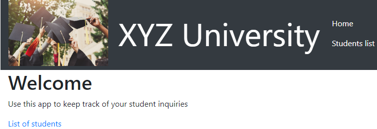
>
> 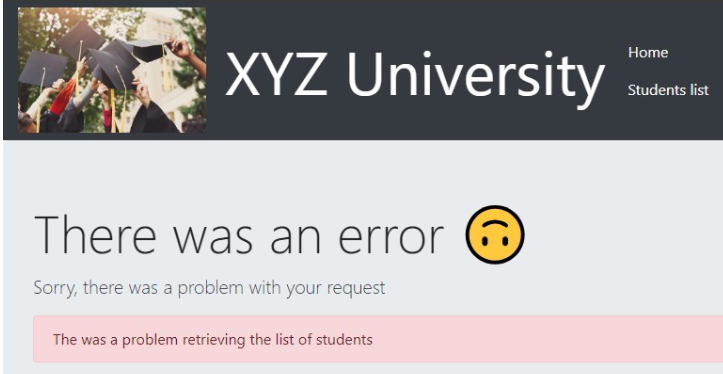

-   Web hiển thị khác với phần 2 vì chưa có database.

-   Trước khi tạo database, thì chúng ta sẽ **tạo Security group cho
    RDS**:

-   Phần 2 chúng ta đã thực hiện tạo **sercurity group (RDS-EC2_SG)**

-   Làm như hướng dẫn của hình dưới đây:

> 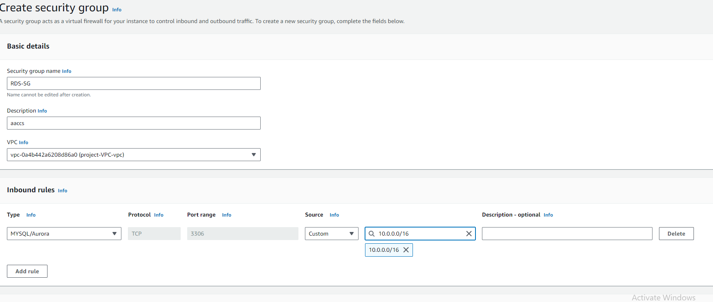
-   Và ấn **Create security group**

```{=html}
<!-- -->
```
-   Bây giờ chúng ta sẽ đi **tạo RDS( database)**

```{=html}
<!-- -->
```
-   Chọn Services-\> All services -\> Chọn **RDS**

-   Chọn **Create database**

-   Đầu tiên, ta chọn như hình dưới đây:

> 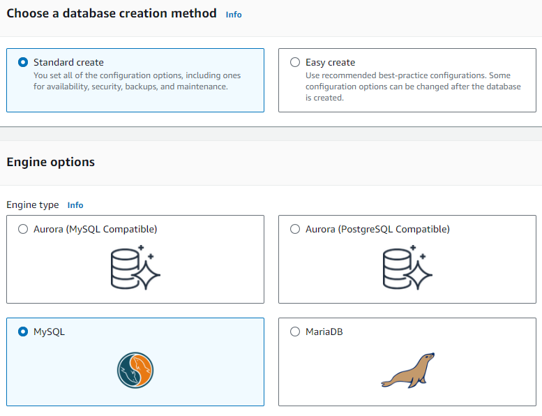
>
> 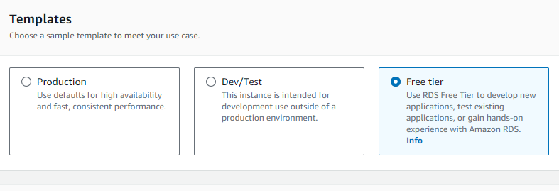

-   Trong phần Settings:

```{=html}
<!-- -->
```
-   DB instance identifier: **STUDENTS**

-   Master username: **nodeapp**

-   Credentials management: Nếu chọn **self managed** thì password mình
    tự tạo( và password tôi tự tạo là "***12345678***"), còn chọn
    Managed in AWS Secrets Manager- most secure thì hệ thống sẽ tự tạo
    cho mình.

```{=html}
<!-- -->
```
-   Trong phần **Connectivity**:

```{=html}
<!-- -->
```
-   Chọn **Connect to an EC2 compute resource**.

-   Chọn **EC2 instance là My web**( web chỉ có giao diện mà chưa có
    database).

-   DB subnet group: Chọn **Automatic setup**( hệ thống sẽ tự tạo cho
    mình)

-   VPC security group: Chọn Choose existing. Sau đó trong Additional
    VPC security group : Chọn **Security group vừa tạo cho RDS.**


-   Trong phần **Database authentication** thì chọn như hình dưới đây:

> 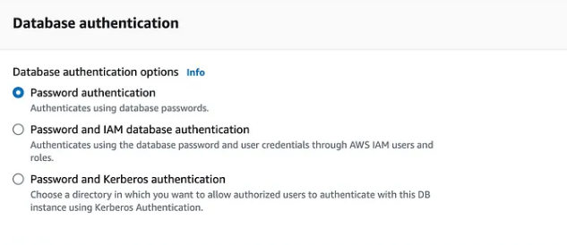

-   Bỏ tích trong **Monitoring**

> 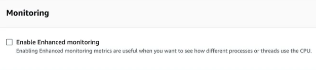
-   Trong phần **Additional configuration**

-   Initial database name : **STUDENTS**

-   Bỏ tích tất cả các mục sau: **Enable automated backups, Enable
    encryption, Log exports, Enable auto minor version upgrade, Enable
    deletion protection.**

-   Maintenance window: chọn **No preference.**


-   Cuối cùng ấn nút **Create database.**

-   RDS của tôi sẽ có **Endpoint & port:**
    *students.ctdqwmiuzlyx.us-east-1.rds.amazonaws.com*


-   Tiếp tục, chúng ta sẽ **cài đặt môi trường cho Cloud 9**

-   Ở khung Search tìm **Cloud9**

-   Chọn **Create environment**

-   Chọn như hình dưới đây( Tùy chỉnh theo nhu cầu người dùng)

> 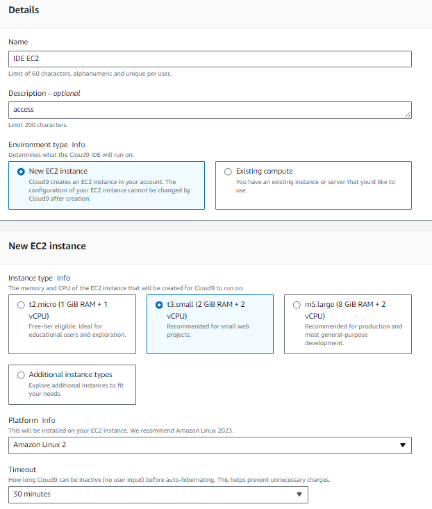

-   Trong phần **Network settings**, chọn như hình dưới đây:

-   VPC : chọn VPC mà mình tạo

-   Subnet: chọn **public subnet 1**

> 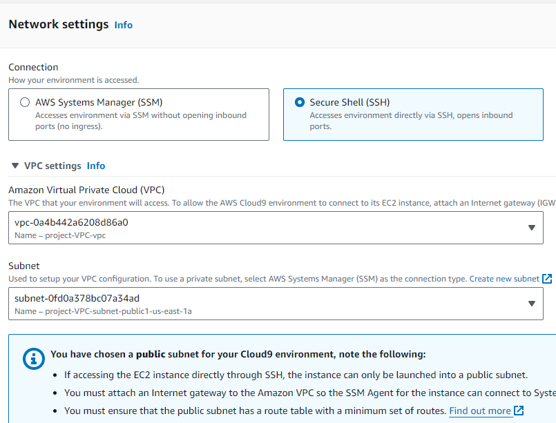

-   Cuối cùng ấn **Create**

-   Nhấn **open**\
    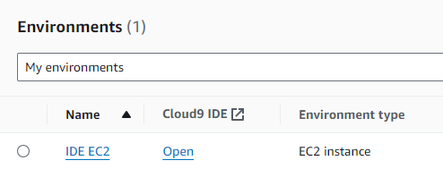

-   Giao diện như sau sẽ hiện ra:

> 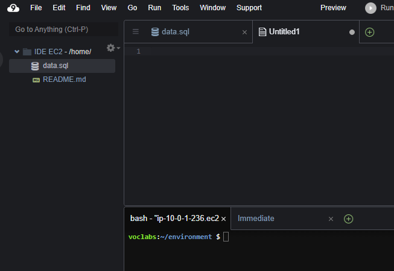

-   Bây giờ chúng ta sẽ tạo **a secret manager in AWS CLOUD9**, bằng câu
    lệnh dưới đây

+-----------------------------------------------------------------------+
| aws secretsmanager create-secret \\                                   |
|                                                                       |
| \--name Mydbsecret \\                                                 |
|                                                                       |
| \--description \"Database secret for web app\" \\                     |
|                                                                       |
| \--secret-string                                                      |
| \"{\\\"user\\\":\\\"\<userna                                          |
| me\>\\\",\\\"password\\\":\\\"\<password\>\\\",\\\"host\\\":\\\"\<RDS |
| Endpoint\>\\\",\\\"db\\\":\\\"\<dbname\>\\\"}\"                       |
+-----------------------------------------------------------------------+

-   Lab của tôi sẽ thay thế như sau:

+-----------------------------------------------------------------------+
| aws secretsmanager create-secret \\                                   |
|                                                                       |
| \--name Mydbsecret \\                                                 |
|                                                                       |
| \--description \"Database secret for web app\" \\                     |
|                                                                       |
| \--secret-string                                                      |
| \"{\"user\":\"nodeapp\",\"password\":\"12345678\",\"host\":\"stude    |
| nts.ctdqwmiuzlyx.us-east-1.rds.amazonaws.com\",\"db\":\"STUDENTS\"}\" |
+-----------------------------------------------------------------------+

-   Nếu chạy thành công trên màn hình Terminal sẽ hiển thị các trường
    như sau:

> ***"ARN"***
>
> ***"Name"***
>
> ***"VersionId"***

-   Tiếp tục, chúng ta sẽ thực hiện **di chuyển cơ sở dữ liệu từ EC2 My
    Temp Web( web có sẵn database) sang RDS** và kết nối với nó bằng câu
    lệnh dưới đây

-   EC2PrivateIP là PrivateIP của My Temp Web.

  -----------------------------------------------------------------------
  mysqldump -h \<EC2PrivateIP\>-u nodeapp -p \--databases
  \<initaildatabasename\> \> data.sql

  -----------------------------------------------------------------------

-   Lab của tôi thay thế như sau:

  -----------------------------------------------------------------------
  mysqldump -h 10.0.1.140 -u nodeapp -p \--databases STUDENTS \> data.sql

  -----------------------------------------------------------------------

-   Sau đó cửa sổ Terminal sẽ hiện ra Enter password

-   Chúng ta sẽ nhập là: ***student12***

-   Sau khi thực hiện thành công dữ liệu sẽ được lưu trong tệp data.sql

```{=html}
<!-- -->
```
-   Bây giờ, chúng ta sẽ nhập dữ liệu từ data.sql vào RDB bằng cách thực
    hiện câu lệnh sau trong cửa sổ Terminal

  -----------------------------------------------------------------------
  mysql -h \<RDSEndpoint\> -u nodeapp -p \<initial datasbase name\> \<
  data.sql

  -----------------------------------------------------------------------

-   Lab của tôi sẽ thay thế như sau:

  -----------------------------------------------------------------------
  mysql -h students.ctdqwmiuzlyx.us-east-1.rds.amazonaws.com -u nodeapp
  -p STUDENTS \< data.sql

  -----------------------------------------------------------------------

-   Sau đó cửa sổ Terminal sẽ hiện ra Enter password

-   Ở đây chúng ta sẽ nhập password đã tạo ở RDS là "***12345678***"

-   Sau khi hoàn thành thì dữ liệu đã được lưu vào RDS

```{=html}
<!-- -->
```
-   Sau khi hoàn thành xong thì bây giờ chúng ta hãy mở **EC2 My Web**
    bằng **Public IPv4 address**, bây giờ chúng ta đã có thể thực hiện
    các chức năng cơ bản như thêm, sửa, xóa student

> 

***Tạo cân bằng tải***

EC2 console -\> navigation left -\> ***LOAD BALANCING*** -\> chọn
**Target group**

-   Tại Target group. Chọn **Create target group** để tạo mới một target
    group.

```{=html}
<!-- -->
```
-   **Tạo target group** có 2 bước:

```{=html}
<!-- -->
```
-   Step 1: Specify group details

-   Step 2: Register targets

```{=html}
<!-- -->
```
-   Tại Step 1:

```{=html}
<!-- -->
```
-   Target type là **Instances**

```{=html}
<!-- -->
```
-   Target group name, nhập tên của target group: **EC2-Instance**

-   IP address type: **IPv4**

-   VPC: Chọn **VPC mình đã tạo**

-   Protocol version: **HTTP1**

> 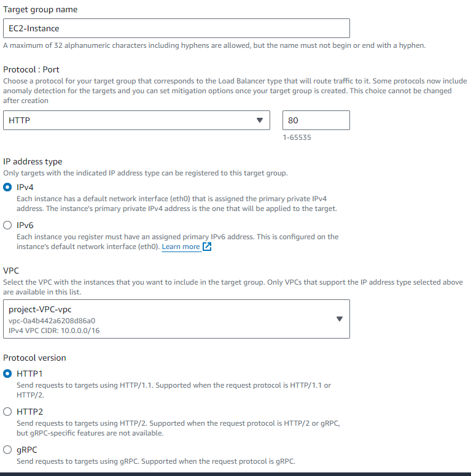{width="5.656449037620297in"
> height="5.722222222222222in"}

-   Ấn **Next** để tiếp tục.

```{=html}
<!-- -->
```
-   Tại Step 2, bảng Available instances

```{=html}
<!-- -->
```
-   Chọn **EC2 My Web** -\> Ấn nút **Include as pending below**

> 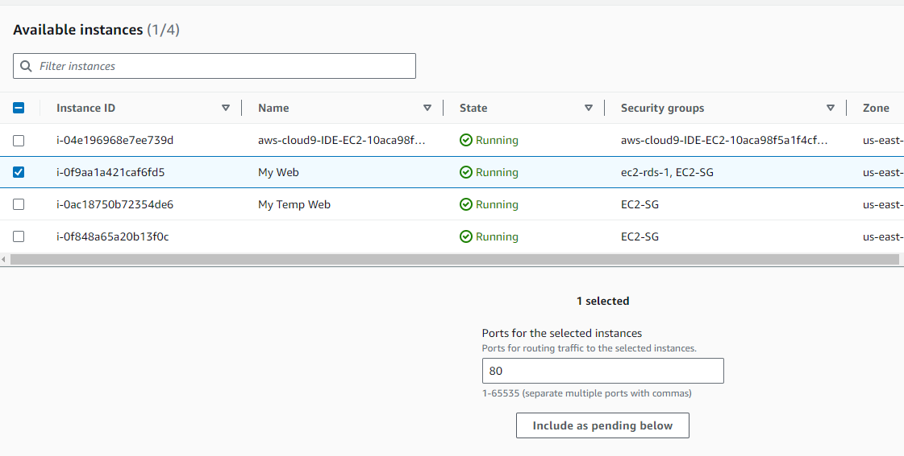{width="5.583333333333333in"
> height="2.8993055555555554in"}

-   Ấn **Create target group**

-   Tạo thành công một Target group

> Sau khi tạo và có được Target group, tiếp theo là **tạo một ALB
> (Application Load Balancers)**

-   Các bước **tạo ALB**:

```{=html}
<!-- -->
```
-   Ở navigation left, dưới ***Load Balancing*** -\> chọn **Load
    Balancers**

-   Tạo một Load Balancers, ấn **Create Load Balancer**

-   Chọn **Application load balancer** và ấn **Create**

> 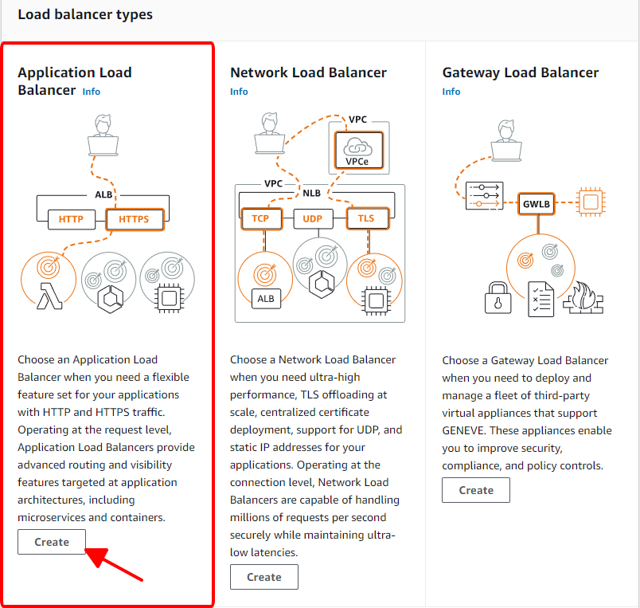{width="5.963542213473316in"
> height="5.659279308836395in"}

-   Tại **Load Balancer Name**, nhập tên của Load Balancer (**C**), Các
    lựa chọn Scheme và IP address type để mặc định:

> 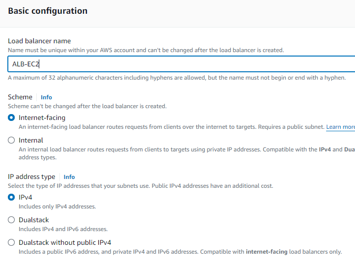{width="5.076388888888889in"
> height="3.7660575240594927in"}

-   Tại **Network mapping**, VPC -\> chọn VPC mình đã tạo

-   Mappings \>\> chọn vùng **1a** và **1b**, tại mỗi vùng lựa chọn
    subnet là **Public subnet**

> 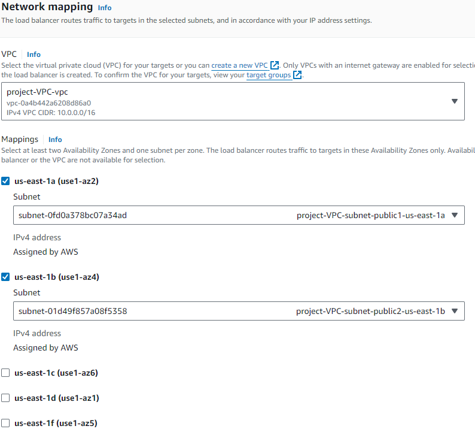{width="5.070489938757655in"
> height="4.649747375328084in"}

-   Tại **Security group**, bỏ chọn **Default** và ấn **create a new
    security group** để tạo mới một **security group cho cân bằng tải**

> 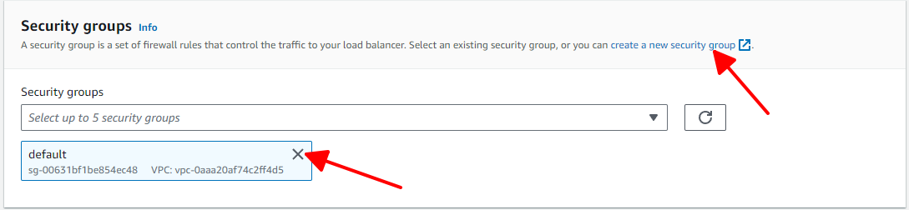{width="6.267716535433071in"
> height="1.4444444444444444in"}

-   Tại **Basic details** của trang **Create security group**

```{=html}
<!-- -->
```
-   Security group name: **ALB-EC2**

-   Description : **ALB to EC2**

-   VPC -\> Chọn VPC mình đã tạo

> 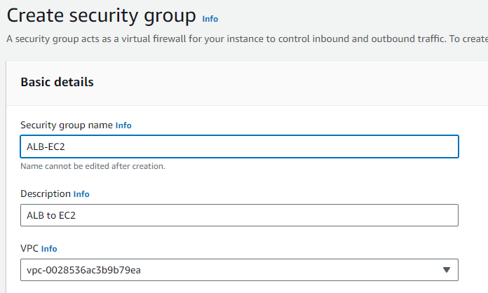{width="3.6144061679790025in"
> height="2.164926727909011in"}

-   Tại **Inbound rule**, chọn **Add rule**

```{=html}
<!-- -->
```
-   Chọn như sau:

```{=html}
<!-- -->
```
-   Type: **All traffic**

-   Source: chọn **Anywhere IPv4**

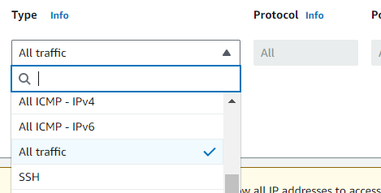{width="3.2239588801399823in"
height="1.6281528871391076in"}
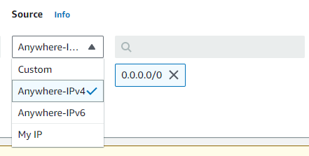{width="3.259669728783902in"
height="1.6405577427821523in"}

-   Chọn **Create Security group** để tạo mới một Security group cho cân
    bằng tải

```{=html}
<!-- -->
```
-   Sau khi tạo thành công Security group **ALB-EC2,** quay lại trang
    **Create Application load balances** -\> Ấn nút
    {width="0.3858530183727034in"
    height="0.24851596675415574in"}để load lại các Security

> 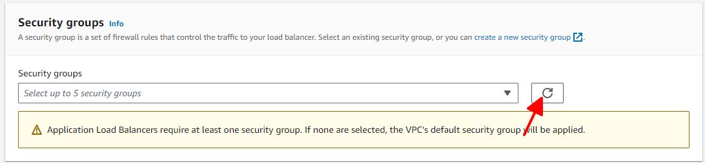{width="5.411458880139983in"
> height="1.260573053368329in"}

-   Sau đó chọn **ALB-EC2**:

> 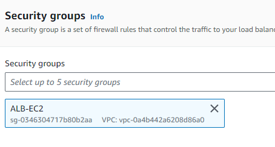{width="3.7083333333333335in"
> height="1.993024934383202in"}

-   Tại Listeners and routing, Default Action : chọn **EC2-Instance**

-   Sau cùng, ấn **Create load balancer** để tạo ALB

**Tạo Autoscaling Group (ASG)**

-   Trước tiên, sao chép một phiên bản AMI (Amazon Machine Image), thực
    hiện:

```{=html}
<!-- -->
```
-   Mở EC2 console

-   Ở thanh bên chọn **Instance**

-   Chọn instance muốn copy AMI (chọn **My Temp Web**)

-   Chọn **Action** -\> **Image and templates** -\> **Create image**

> 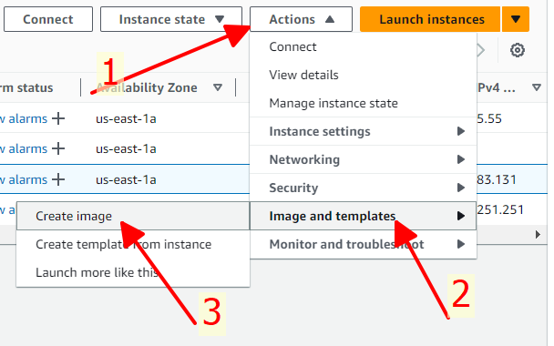{width="4.265625546806649in"
> height="2.6576410761154854in"}

-   Nhập tên và mô tả cho Image -\> chọn **Create Image** để khởi tạo

```{=html}
<!-- -->
```
-   Tạo AutoScaling Group:

```{=html}
<!-- -->
```
-   Ở navigation left , chọn **Auto Scaling Groups** bên dưới mục
    ***Auto Scaling***

-   Ấn vào **Create Auto Scaling group**

-   Nhập tên cho Auto Scaling group (**AS GR)**

-   Chọn **Create a launch template**

> 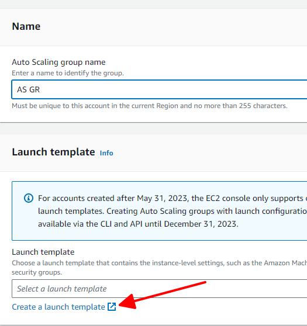{width="3.4008639545056867in"
> height="3.25in"}

-   Sau đó sẽ dẫn sang trang **Create launch template**, tại đây nhập
    tên và mô tả cho launch template

> 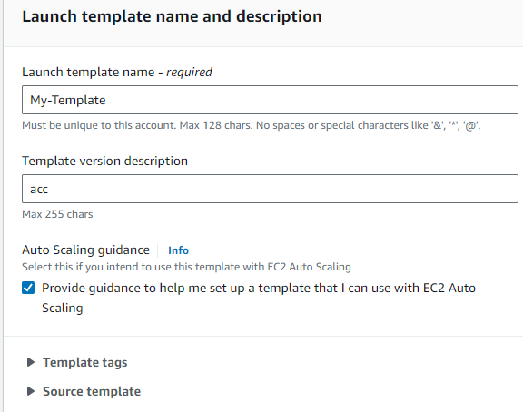{width="4.42290791776028in"
> height="3.486111111111111in"}

-   Chọn **My AMIs**

> 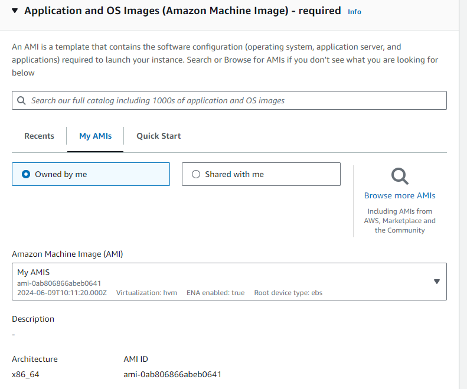{width="4.805555555555555in"
> height="3.999307742782152in"}

-   Tại **Instance type**, chọn ***t2.micro***, **Key pair** -\>
    **vockey**

```{=html}
<!-- -->
```
-   Tại **Network Settings**:

> Firewall: **Select existing security group**
>
> Security groups: **EC2-SG**

-   Ở mục **Advanced details**

```{=html}
<!-- -->
```
-   **IAM Instance Profile** chọn
    **LabInstanceProfile**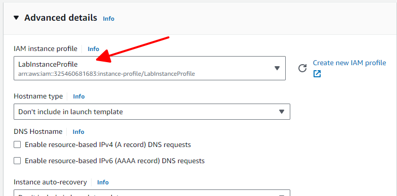{width="4.997748250218723in"
    height="2.4704779090113735in"}

```{=html}
<!-- -->
```
-   Ấn **Create launch template**

```{=html}
<!-- -->
```
-   Sau khi tạo thành công, quay lại trang Tạo **Auto Scaling group**

```{=html}
<!-- -->
```
-   **Launch template** -\> chọn Template vừa tạo (chọn **My-Template**)

```{=html}
<!-- -->
```
-   Chọn **Next** để sang step 2

-   Tại **Network**, chọn VPC của mà mình đã tạo

-   Tại **Availability Zones and subnets** chọn 2 vùng Public (Public
    subnet 1 và Public subnet 2)

> 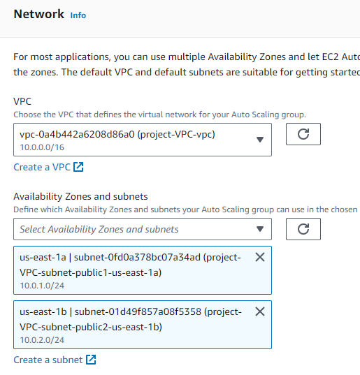{width="3.3071139545056867in"
> height="3.445680227471566in"}

-   Chọn **Next** để sang step 3

-   Tại **Configure advanced options - optional**

```{=html}
<!-- -->
```
-   **Load balancing** -\> **Attach to an existing load balancer**

-   **Attach to an existing load balancer** -\> chọn target groups vừa
    tạo là **EC2-Instance**

```{=html}
<!-- -->
```
-   Nhấn **Next** để sang step 4

-   Tại **Configure group size and scaling,** thực hiện như sau:

> Group size -\> Desired capacity -\> Nhập **2**
>
> Scaling -\> Min desired capacity nhập **1**

Max desired capacity nhập **4**

Chọn: **Target tracking scaling policy** -\> Target value nhập **50**

-   Nhấn **Next**

-   Tại step 5 và step 6, Nhấn **Next**

-   Step 7: nhấn **Create Auto Scaling group**

> =\> Đã tạo thành công Auto Scaling group

**Loadtest trang web**

-   Chúng ta sẽ truy cập Cloud9 đã tạo tại các phần trước để chạy load
    test

-   Sau đó chúng ta sẽ thực hiện câu lệnh: npm install -g loadtest để
    tải tools load test về máy

> 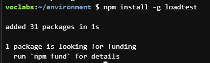{width="4.416666666666667in"
> height="1.3333333333333333in"}

-   Sau khi hoàn thành ta sẽ tải được thông báo thành công như trên

-   Ta sẽ dùng câu lệnh sau để thử chạy load test

> loadtest \--rps 1000 -c 500 -k \<\<ELB URL\>\>

-   Giải thích qua thì \--rps 1000 có nghĩa là sẽ gửi 1000 rps (request
    per sec) tới máy chủ

-   -c 500 có nghĩa là sẽ gửi đồng thời 500 request mỗi lần gửi

-   Cờ -k mang nghĩa là TCP keep-alive tức là sẽ giữ kết nối HTTP mở
    liên tục và sẽ tái sử dụng thay vì đóng lại.

-   Còn trường \<\<ELB URL\>\> sẽ thay bằng URL của trang web cần load
    test

-   Sau khi chạy thử thì ta được trả về các thông tin sau:

-   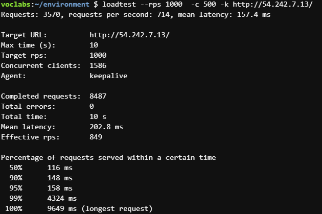{width="6.267716535433071in"
    height="4.166666666666667in"}

```{=html}
<!-- -->
```
-   Trường Effective rps cho ta biết số request thực tế mà web thực thi
    được chỉ có 849 tức là không được 1000 rps như ta mong đợi nhưng số
    lượng request đáp ứng được 8487 nên là web cũng khá ổn.

-   Nhưng độ trễ trung bình chỉ có 202.8ms cũng khá ổn .

-   1585 Concurrent clients là con số khá tốt khi web có thể handle được
    số lượng lớn người dùng trong cùng thời điểm.
